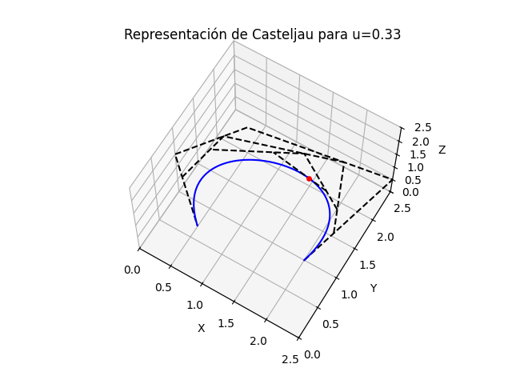
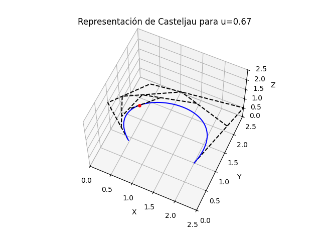
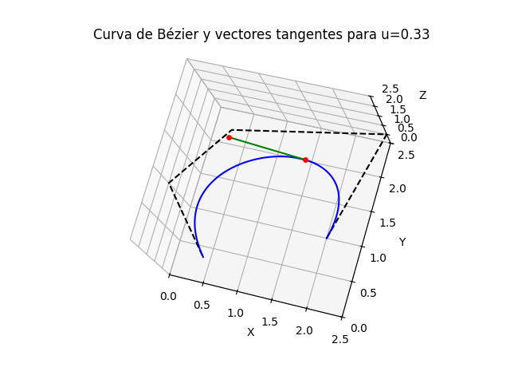
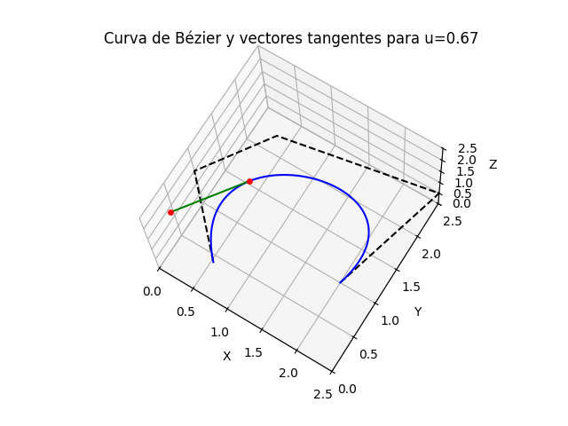

# PLOTS PRÁCTICA TEÓRICA MED 24-25

## TEMA 2. CURVAS DE BÉZIER

### PRACTICA 2.1

Programar el cálculo de la representación de Casteljau y computar el gráfico de la visualización geométrica como en la página 25 de la presentación teórica. Tomar los puntos de control (en el espacio tridimensional) definidos en l_1_Bezier_5p.py

Computar varios gráficos, por ejemplo, uno para u=1/3 y otro para u=2/3.

CÓDIGO

```# p es el ndarray con los n+1 puntos de control por filas, n=4

... plot de la curva de Bézier y el polígono de control original

u = 1/3    # calcular también para para u = 2/3

for k in range(1, n+1):

    p = (1 - u) * p[0 : n-k+1, :] + u * p[1 : n-k+2, :]

    ... plot el nuevo polígono de control (un punto en el paso final)
```





### PRACTICA 2.2

En la curva de Bézier p(u) del programa l_1_Bezier_5p.py calcular los puntos de control que definen la derivada q(u) = p'(u) como curva de Bézier de grado n-1, el hodógrafo. Calcular el vector derivada en varios puntos, por ejemplo u=1/3 y u=2/3, computando el gráfico con la curva p(u) y estos dos vectores tangentes sobre los puntos señalados. En lugar de normalizar los vectores derivada, multiplicarlos por un escalar (igual para los dos) a fin de verlos adecuadamente en el gráfico.

CÓDIGO

```# p es el ndarray con los n+1 puntos de control por filas, n=4

... plot la curva de Bézier

... computar el ndarray q de los puntos de control del hodógrafo, escribiendo el cálculo en forma compacta (sin iterar sobre los puntos)

u = 1/3    # repetir para u = 2/3

pu = np.zeros(3)

for i in range(n+1):
    pu += p[i, :] * comb(n, i, exact=True) * u**i * (1 - u)**(n-i)

qu = np.zeros(3)

for i in range(n):
    qu += q[i, :] * comb(n-1, i, exact=True) * u**i * (1 - u)**(n-1-i)

... plot la línea entre el punto pu y el punto pu + qu * f donde f es un factor adecuado
```





## TEMA 3. CURVAS B-SPLINE

### PRACTICA 3.1

Considerar el B-spline clamped cúbico con estos 9+1 nodos y 5+1 puntos de control:

u_vec = [0, 0, 0, 0, 0.33, 0.67, 1, 1, 1, 1]
p = np.array([ [-5, -5], [-5, 4], [0, 8], [5, 5], [5, -2], [0, -3] ]).T

Calcular las funciones base N_0,3, N_1,3, ..., N_5,3 y computar el gráfico del polígono de control y de la curva p(u) del B-spline, identificando los trazos de curva correspondientes a los segmentos del parámetro con colores distintos, como se hace en la primera parte del programa l_5_derivada_spline.py. Computar asimismo el gráfico de las funciones base para p=3 (fijarse en l_2_base_nodo_mult.py).

### PRACTICA 3.2

En el B-spline anterior mover el punto de control p1, computando los gráficos de la curva original y de la curva nueva, con sus polígonos de control, representar cada segmento (trazo de curva) con un color distinto. Observar qué trazos se modifican.

Repetir la práctica moviendo el punto de control p2 en lugar de p1.

### PRACTICA 3.3

En el B-spline de la Práctica 3.1 insertar el nodo u = 0.5 siguiendo el procedimiento reflejado en el Cuestionario. Computar el gráfico del nuevo polígono de control y de la nueva curva B-spline, con un color distinto para cada trazo de la curva.

Comparar los trazos de curva del nuevo B-spline con los trazos del B-spline original: los que se preservan y los que resultan de la división del segmento donde se inserta el nodo, cuáles se modifican.